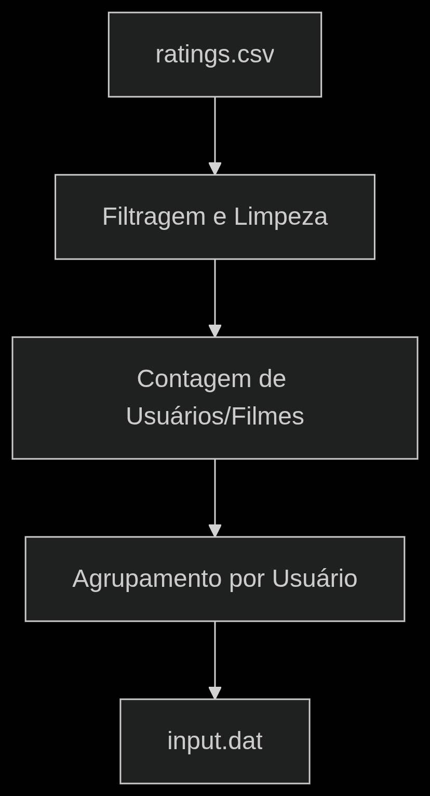

# Sistema de Recomendação de Filmes 🎥
<div align="center">
    
</div>

## INTRODUÇÃO

<p>No cenário digital atual, a vasta quantidade de informações e opções disponíveis pode ser esmagadora para os usuários. Plataformas de streaming de vídeo, lojas de e-commerce e redes sociais enfrentam o desafio de apresentar conteúdo relevante e personalizado em meio a um volume gigantesco de dados. Nesse contexto, sistemas de recomendação emergem como ferramentas indispensáveis, atuando como filtros inteligentes para guiar os usuários através de um universo de possibilidades.

A capacidade de prever o interesse de um usuário por um determinado item — seja um filme, um produto ou um artigo — é fundamental para aprimorar a experiência digital, aumentar o engajamento e impulsionar a descoberta de novos conteúdos. Essa previsão é influenciada por uma variedade de fatores, incluindo o histórico de consumo do usuário, suas interações com outros itens, o comportamento de usuários com gostos semelhantes e até mesmo as características intrínsecas dos próprios itens.

Além de otimizar a experiência individual do usuário, as consequências de um sistema de recomendação eficaz vão além da satisfação pessoal, impactando diretamente o sucesso das plataformas digitais. Ao conectar usuários a conteúdos que realmente os engajam, esses sistemas contribuem para o aumento do tempo de permanência, a fidelização de clientes e a geração de receita. A modelagem precisa do comportamento e das preferências do usuário é, portanto, uma ferramenta vital, e deve ser integrada de forma inteligente no design de qualquer plataforma que almeje oferecer uma experiência personalizada. Essa abordagem permite a identificação de tendências de consumo e a aplicação de estratégias proativas para aprimorar a relevância das recomendações.</p>


## 🎯 OBJETIVOS

O trabalho final da disciplina de Algoritmos e Estruturas de Dados I, proposto pelo professor Michel Pires, tem como objetivo a construção de um **sistema de recomendação de filmes** utilizando a base de dados **MovieLens 25M**.

O sistema deve ser capaz de, a partir do **perfil dos usuários e das características dos filmes avaliados**, sugerir **filmes similares** que possam ser do interesse de um determinado usuário. Para isso, é necessário realizar um **pré-processamento robusto da base de dados** e aplicar **algoritmos de recomendação baseados em similaridade**.

Entre as etapas principais estão:

* **Pré-processamento da base `ratings.csv`** para filtrar e organizar os dados;
* Escolha e implementação de um **algoritmo de recomendação**, como:

  * Similaridade do cosseno;
  * Distância Euclidiana;
  * Índice de Jaccard;
* Geração das recomendações para usuários definidos no arquivo `explore.dat`;
* Escrita das recomendações no arquivo `output.dat` em formato exigido.

---

### 🛠️ REGRAS DE IMPLEMENTAÇÃO

O professor definiu algumas **regras obrigatórias** que devem ser seguidas na implementação:

* O **arquivo principal da base de dados** deve ser `ratings.csv`, do conjunto **MovieLens 25M**;

* O sistema deve considerar apenas:

  * Usuários com **pelo menos 50 avaliações distintas**;
  * Filmes avaliados por **pelo menos 50 usuários diferentes**;

* Avaliações duplicadas ou inconsistentes devem ser removidas;

* O arquivo `input.dat` deve ser gerado com o seguinte formato:

  ```
  usuario_id item_id1:nota1 item_id2:nota2 item_id3:nota3 ...
  ```

* Arquivos devem seguir o seguinte padrão:

| Arquivo       | Local       | Formato       | Descrição                                           |
| ------------- | ----------- | ------------- | --------------------------------------------------- |
| `input.dat`   | `datasets/` | Texto (UTF-8) | Base processada de avaliações por usuário           |
| `explore.dat` | `datasets/` | Texto (UTF-8) | Lista de usuários para os quais gerar recomendações |
| `output.dat`  | `outcome/`  | Texto (UTF-8) | Saída com as recomendações para cada usuário        |


* A compilação deve ser feita usando um `Makefile` com as regras `make`, `make run` e `make clean`;
* O sistema deve compilar e executar corretamente no **Ubuntu 24.04 LTS com `g++ 13+`**;

---

## 🧪 METODOLOGIA

Nesta seção, apresentamos a metodologia adotada no desenvolvimento do projeto, detalhando as etapas de pré-processamento dos dados e os algoritmos de recomendação utilizados. Discutimos os critérios que motivaram essas escolhas, bem como as alterações realizadas ao longo do processo, que impactaram diretamente o desempenho e influenciaram na decisão final.

### VISÃO GERAL

**O projeto é estruturado em três etapas principais que determinam seu desempenho:**

1. **Pré-processamento de dados**:  
   Processamento inicial do arquivo `ratings.csv` do MovieLens para construção de uma base de dados consistente, aplicando filtros de qualidade e removendo inconsistências.

2. **Cálculo de similaridades**:  
   Implementação do algoritmo de recomendação baseado na Similaridade de Jaccard, responsável por analisar padrões de avaliação e identificar relações entre usuários e filmes.

3. **Geração de recomendações**:  
   Produção das recomendações personalizadas com base nas similaridades calculadas, formatadas conforme os requisitos de saída do projeto.

### 1 - PRÉ-PROCESSAMENTO
#### FLUXO GERAL

<div align="center">
    
</div>


## ANÁLISES E CONCLUSÕES

  
## COMPILAÇÃO E EXECUÇÃO
</hr>
A algorítmo disponibilizado possui um arquivo Makefile que realiza todo o procedimento de compilação e execução. Para tanto, temos as seguintes diretrizes de execução:

| Comando                |  Função                                                                                           |                     
| -----------------------| ------------------------------------------------------------------------------------------------- |
|  `make clean`          | Apaga a última compilação realizada contida na pasta build                                        |
|  `make`              	 | Compila o código-fonte conforme as regras definidas no Makefile | 
|  `make run`            | Executa a compilação do programa utilizando o gcc, e o resultado vai para a pasta build, além de em seguida executar o programa da pasta build após a realização da compilação |

## AUTORES

Esse trabalho foi realizado pelos seguintes integrantes.

[Fabricio Quintilhiano;](https://github.com/F-Quintilhiano)

[Jean Pedro Oliveira;](https://github.com/Jeanaraga)

[Lorena Ávila;](https://github.com/Lorenaavila20)

[Otávio Hiratsuka;](https://github.com/otaviohiratsuka)

Alunos do curso de Engenharia da Computação no [CEFET-MG](https://www.cefetmg.br)


  
</div>
